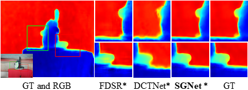
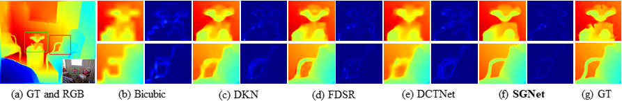
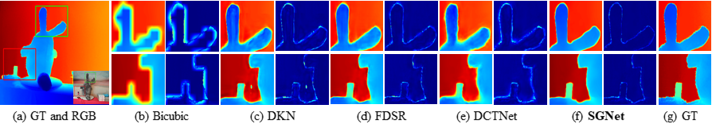

# <p align="center">SGNet: Structure Guided Network via Gradient-Frequency Awareness for Depth Map Super-Resolution</p>
<p align="center"><a href="https://scholar.google.com/citations?user=VogTuQkAAAAJ&hl=zh-CN">Zhengxue Wang</a>, <a href="https://scholar.google.com/citations?user=hnrkzIEAAAAJ&hl=zh-CN&oi=sra">Zhiqiang Yan✉</a>, <a href="https://scholar.google.com/citations?user=6CIDtZQAAAAJ&hl=zh-CN">Jian Yang✉</p>
<p align="center">PCA Lab, Nanjing University of Science and Technology, China</p>

### This repository is an official PyTorch implementation of our <a href="https://arxiv.org/pdf/2312.05799.pdf">SGNet</a> (AAAI 2024).

## Dependencies
```
Python==3.11.5
PyTorch==2.1.0
numpy==1.23.5 
torchvision==0.16.0
scipy==1.11.3
thop==0.1.1.post2209072238
Pillow==10.0.1
tqdm==4.65.0
```

## Models
All pretrained models can be found <a href="https://drive.google.com/drive/folders/17mCRfsNj0f_BNY3viHcR6M1camCVoAb8?usp=sharing">here</a>.
Please note that some variable names in the initial pretrained .pth files are not consistent with those in the latest code. Therefore, we have reuploaded the new .pth files for completeness, named xxx_R.pth.

## Datasets
[NYU-v2](https://drive.google.com/file/d/1osYRaDfMYuyiTkJwDbKl3kHwyevDLsZf/view?usp=sharing)

[RGB-D-D](https://github.com/lingzhi96/RGB-D-D-Dataset)

[Lu & Middlebury](https://web.cecs.pdx.edu/~fliu/project/depth-enhance/)

## Train on synthetic NYU-v2
### x4 DSR
> python train.py --scale 4 --num_feats 48
### x8 DSR
> python train.py --scale 8 --num_feats 40
### x16 DSR
> python train.py --scale 16 --num_feats 40
## Train on real-world RGB-D-D
> python train.py --scale 4 --num_feats 24

## Test on synthetic datasets
### x4 DSR
> python test.py --scale 4 --num_feats 48
### x8 DSR
> python test.py --scale 8 --num_feats 40
### x16 DSR
> python test.py --scale 16 --num_feats 40
## Test on real-world RGB-D-D
> python test.py --scale 4 --num_feats 24


## Experiments

<p align="center">

</p>

### Visual comparison

<b>Train & test on real-world RGB-D-D: <b/>
<p align="center">

</p>
<b>Train & test on synthetic NYU-v2 (x16): <b/>
<p align="center">

</p>
<b>Train on NYU-v2, test on RGB-D-D (x16): <b/>
<p align="center">

</p>


## Acknowledgements
We thank all reviewers for their professional and instructive suggestions.

We thank these repos sharing their codes: [DKN](https://github.com/cvlab-yonsei/dkn) and [SUFT](https://github.com/ShiWuxuan/SUFT).


## Citation

If our method proves to be of any assistance, please consider citing:
```
@inproceedings{wang2024sgnet,
  title={Sgnet: Structure guided network via gradient-frequency awareness for depth map super-resolution},
  author={Wang, Zhengxue and Yan, Zhiqiang and Yang, Jian},
  booktitle={Proceedings of the AAAI Conference on Artificial Intelligence},
  volume={38},
  number={6},
  pages={5823--5831},
  year={2024}
}
```
